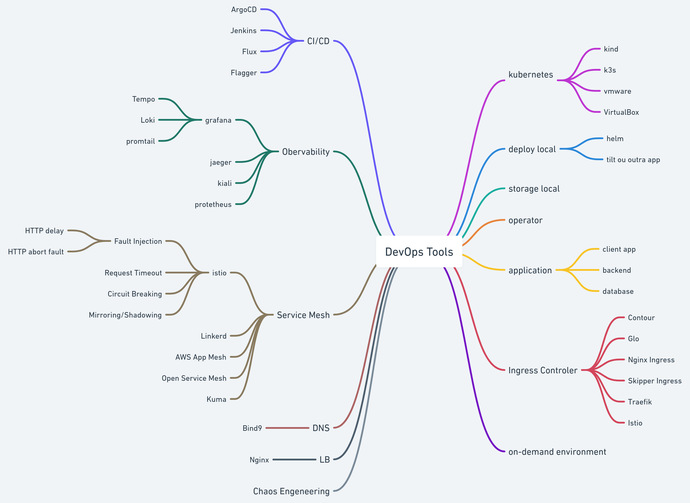

# Why this repo?
This repo aims to study tools we could use in SRE/DevOps/Platform Engineer jobs.

You could expect each tool that will be studied in this repo will always have the following:

* IaC that implements the tools.
* Code to test the IaC created for the tool
  * Terratest
  * Molecule (ansible)
* GitHub Actions to test the IaC built
* Always will have one automation, makefile or ansible, to create all necessary infrastructure to run the tool.

Pre-require necessary:
* Go 1.20 or newer
* Docker 23.0.4 or newer

# The Future

The idea is to implement, not just, but at least the mindmap below:

